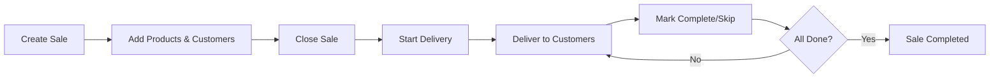

# 🥐 Breakfast Business Management API

> A modern FastAPI backend for managing a breakfast delivery business - built for efficiency, designed for growth.

[](https://fastapi.tiangolo.com/)
[](https://www.python.org/)
[](https://www.sqlite.org/)
[](LICENSE)

---

## 📋 Table of Contents

- [Features](#-features)
- [Tech Stack](#-tech-stack)
- [Getting Started](#-getting-started)
- [API Documentation](#-api-documentation)
- [Project Structure](#-project-structure)
- [Database Schema](#-database-schema)
- [Testing](#-testing)
- [Deployment](#-deployment)
- [Contributing](#-contributing)

---

## ✨ Features

### 🛒 Product Management
- Create and manage products with buy/sell prices
- Track profit margins automatically
- Full CRUD operations with validation

### 👥 Customer Management
- Store customer information (name, address, phone)
- Track customer purchase history
- Organized delivery routes

### 📦 Sales & Orders
- Create sales with multiple customers and products
- Track revenue and profit per sale
- Historical sales data and analytics

### 🚚 Delivery Management *(Phase 1)*
- **Smart delivery routing** - Customers ordered alphabetically (customizable)
- **Real-time progress tracking** - See completed, pending, and skipped deliveries
- **Flexible status management** - Mark as delivered, skip, or reset
- **Order cutoff system** - Configurable 36-hour cutoff before delivery
- **Sale lifecycle** - Draft → Closed → In Progress → Completed

### 🔐 Authentication & Security
- JWT-based authentication
- User-specific data isolation
- Secure password hashing with bcrypt

---

## 🛠 Tech Stack

| Technology | Purpose |
|------------|---------|
| **FastAPI** | Modern, fast web framework |
| **SQLAlchemy** | Async ORM for database operations |
| **SQLite** | Lightweight, file-based database |
| **Pydantic** | Data validation and settings |
| **JWT** | Secure token-based authentication |
| **Pytest** | Comprehensive testing framework |

---

## 🚀 Getting Started

### Prerequisites

- Python 3.11 or higher
- pip (Python package manager)
- SQLite3 (usually pre-installed)

### Installation

1. **Clone the repository**
   ```bash
   git clone https://github.com/yourusername/breakfast-business-api.git
   cd breakfast-business-api
   ```

2. **Create a virtual environment**
   ```bash
   python -m venv .venv
   
   # Windows
   .venv\Scripts\activate
   
   # Linux/Mac
   source .venv/bin/activate
   ```

3. **Install dependencies**
   ```bash
   pip install -r requirements.txt
   ```

4. **Configure environment variables**
   ```bash
   cp .env.example .env
   # Edit .env with your configuration
   ```

5. **Run database migrations** *(if Phase 1 installed)*
   ```bash
   sqlite3 core/breakfast.db < migration_add_delivery.sql
   ```

6. **Start the server**
   ```bash
   uvicorn main:app --reload
   ```

7. **Visit the interactive API docs**
   ```
   http://localhost:8000/docs
   ```

---

## 📚 API Documentation

### Core Endpoints

#### Authentication
```http
POST   /auth/signup          # Create new user account
POST   /auth/login           # Login and receive JWT token
GET    /auth/me              # Get current user info
```

#### Products
```http
GET    /products/            # List all products
GET    /products/{id}        # Get product details
POST   /products/            # Create new product
PUT    /products/{id}        # Update product
DELETE /products/{id}        # Delete product
```

#### Customers
```http
GET    /customers/           # List all customers
GET    /customers/{id}       # Get customer details
POST   /customers/           # Create new customer
PUT    /customers/{id}       # Update customer
DELETE /customers/{id}       # Delete customer
```

#### Sales
```http
GET    /sales/               # List all sales
GET    /sales/{id}           # Get sale details
POST   /sales/               # Create new sale
PUT    /sales/{id}           # Update sale
DELETE /sales/{id}           # Delete sale
PATCH  /sales/{id}           # Update sale status/date
GET    /sales/{id}/state     # Check if sale accepts orders
```

#### Delivery Management *(Phase 1)*
```http
POST   /sales/{id}/delivery                          # Start delivery process
GET    /sales/{id}/delivery                          # View delivery route
PATCH  /sales/{id}/delivery                          # Reorder delivery route
GET    /sales/{id}/delivery/progress                 # Get delivery progress
PATCH  /sales/{id}/delivery/customers/{id}/status    # Update delivery status
```

### Example Requests

<details>
<summary><b>Create a Sale</b></summary>

```bash
POST /sales/
Authorization: Bearer YOUR_JWT_TOKEN

{
  "date": "2024-12-20",
  "customer_sales": [
    {
      "customer_id": 1,
      "products": [
        {
          "product_id": 1,
          "quantity": 2
        }
      ]
    }
  ]
}
```
</details>

<details>
<summary><b>Start Delivery</b></summary>

```bash
# 1. Close the sale
PATCH /sales/1
{
  "status": "closed"
}

# 2. Start delivery
POST /sales/1/delivery
```
</details>

<details>
<summary><b>Mark Delivery Complete</b></summary>

```bash
PATCH /sales/1/delivery/customers/5/status
{
  "status": "completed",
  "amount_collected": 12.50
}
```
</details>

---

## 📁 Project Structure

```
breakfast-business-api/
├── auth/                      # Authentication module
│   ├── crud.py               # User database operations
│   ├── dependencies.py       # Auth dependencies (JWT)
│   ├── models.py             # User model
│   ├── router.py             # Auth endpoints
│   └── schemas.py            # Pydantic schemas
├── core/                      # Core configuration
│   ├── config.py             # Settings & environment vars
│   ├── database.py           # Database connection
│   └── security.py           # Password hashing, JWT
├── products/                  # Product management
│   ├── crud.py
│   ├── models.py
│   ├── router.py
│   └── schemas.py
├── customers/                 # Customer management
│   ├── crud.py
│   ├── models.py
│   ├── router.py
│   └── schemas.py
├── sales/                     # Sales & delivery
│   ├── crud.py               # Sales CRUD operations
│   ├── crud_delivery.py      # Delivery CRUD operations
│   ├── models.py             # Sale, SaleItem, SaleDeliveryStep
│   ├── router.py             # Sales endpoints
│   ├── router_delivery.py    # Delivery endpoints
│   └── schemas.py            # All schemas
├── tests/                     # Test suite
│   ├── conftest.py           # Test fixtures
│   ├── test_auth.py
│   ├── test_products.py
│   ├── test_customers.py
│   └── test_sales.py
├── .env                       # Environment configuration
├── main.py                    # Application entry point
├── requirements.txt           # Python dependencies
└── README.md                  # This file
```

---

## 🗄 Database Schema

### Entity Relationship Diagram

```
┌─────────┐         ┌──────────────┐         ┌──────────┐
│  User   │────────▶│     Sale     │◀───────▶│ Customer │
└─────────┘         └──────────────┘         └──────────┘
                           │                        
                           │                        
                           ▼                        
                    ┌──────────────┐         ┌──────────┐
                    │   SaleItem   │────────▶│ Product  │
                    └──────────────┘         └──────────┘
                           │
                           │
                           ▼
                 ┌────────────────────┐
                 │ SaleDeliveryStep   │
                 └────────────────────┘
```

### Key Tables

<details>
<summary><b>User</b></summary>

| Column | Type | Description |
|--------|------|-------------|
| id | Integer | Primary key |
| email | String | Unique email |
| hashed_password | String | Bcrypt hash |
| created_at | DateTime | Account creation |
</details>

<details>
<summary><b>Product</b></summary>

| Column | Type | Description |
|--------|------|-------------|
| id | Integer | Primary key |
| name | String | Product name |
| description | String | Optional description |
| buy_price | Float | Purchase price |
| sell_price | Float | Selling price |
| user_id | Integer | Owner |
</details>

<details>
<summary><b>Sale</b></summary>

| Column | Type | Description |
|--------|------|-------------|
| id | Integer | Primary key |
| user_id | Integer | Owner |
| date | Date | Delivery date |
| status | String | draft/closed/in_progress/completed |
</details>

<details>
<summary><b>SaleDeliveryStep</b> (Phase 1)</summary>

| Column | Type | Description |
|--------|------|-------------|
| id | Integer | Primary key |
| sale_id | Integer | Parent sale |
| customer_id | Integer | Customer to deliver to |
| sequence_order | Integer | Delivery order |
| status | String | pending/completed/skipped |
| completed_at | DateTime | When delivered |
| amount_collected | Float | Money received |
| skip_reason | String | Why skipped |
</details>

---

## 🧪 Testing

### Run Tests

```bash
# Install test dependencies
pip install -r requirements-dev.txt

# Run all tests
pytest

# Run with coverage
pytest --cov=. --cov-report=html

# View coverage report
open htmlcov/index.html
```

### Test Coverage

Current coverage: **~90%**

- ✅ Authentication (signup, login, protected routes)
- ✅ Products CRUD (all operations)
- ✅ Customers CRUD (all operations)
- ✅ Sales creation and management
- ✅ Delivery workflow (start, complete, skip, progress)

---

## 🌐 Deployment

### Environment Variables

Required environment variables in `.env`:

```bash
# Database
DATABASE_URL=sqlite+aiosqlite:///./core/breakfast.db

# Security
JWT_SECRET_KEY=your-secret-key-here-change-in-production
JWT_ALGORITHM=HS256
JWT_EXPIRATION_HOURS=24

# Business Logic
ORDER_CUTOFF_HOURS=36

# App Info
APP_NAME=Breakfast Business API
APP_VERSION=2.0.1
```

### Production Deployment

<details>
<summary><b>Deploy to Railway</b></summary>

1. Install Railway CLI
   ```bash
   npm install -g @railway/cli
   ```

2. Login and deploy
   ```bash
   railway login
   railway init
   railway up
   ```

3. Set environment variables in Railway dashboard
</details>

<details>
<summary><b>Deploy to Render</b></summary>

1. Create `render.yaml`:
   ```yaml
   services:
     - type: web
       name: breakfast-api
       env: python
       buildCommand: pip install -r requirements.txt
       startCommand: uvicorn main:app --host 0.0.0.0 --port $PORT
   ```

2. Connect GitHub repo in Render dashboard
3. Set environment variables
</details>

---

## 🔄 Workflow Example



### Typical Day Flow

1. **Morning**: Create sale with delivery date
2. **Up to 36h before**: Customers place orders
3. **36h before**: Sale automatically closes
4. **Delivery day**: Start delivery, follow route
5. **During deliveries**: Mark complete, skip if needed, track progress
6. **End of day**: Review completed deliveries, check money collected

---

## 🎯 Roadmap

### ✅ Phase 1: Delivery Management (Current)
- Sale lifecycle (draft → closed → in_progress → completed)
- Delivery route creation
- Real-time progress tracking
- Flexible status updates

### 🔄 Phase 2: WhatsApp Integration (Next)
- Automated order links via WhatsApp
- Order confirmations
- Delivery notifications
- Customer communication

### 📅 Phase 3: Advanced Features
- Analytics dashboard
- Revenue/profit reports
- Customer insights
- Inventory management
- Multi-day route optimization

---

## 🤝 Contributing

Contributions are welcome! Please follow these steps:

1. Fork the repository
2. Create a feature branch (`git checkout -b feature/AmazingFeature`)
3. Commit your changes (`git commit -m 'Add some AmazingFeature'`)
4. Push to the branch (`git push origin feature/AmazingFeature`)
5. Open a Pull Request

### Code Style

- Follow PEP 8
- Use type hints
- Write docstrings for functions
- Add tests for new features

---

## 📄 License

This project is licensed under the MIT License - see the [LICENSE](LICENSE) file for details.

---

## 👤 Author

**Your Name**
- GitHub: [@yourusername](https://github.com/yourusername)
- Email: your.email@example.com

---

## 🙏 Acknowledgments

- Built with [FastAPI](https://fastapi.tiangolo.com/)
- Inspired by real-world breakfast delivery challenges
- Designed for small business efficiency

---

<div align="center">

**⭐ Star this repo if you find it useful!**

Made with ❤️ and ☕

</div>